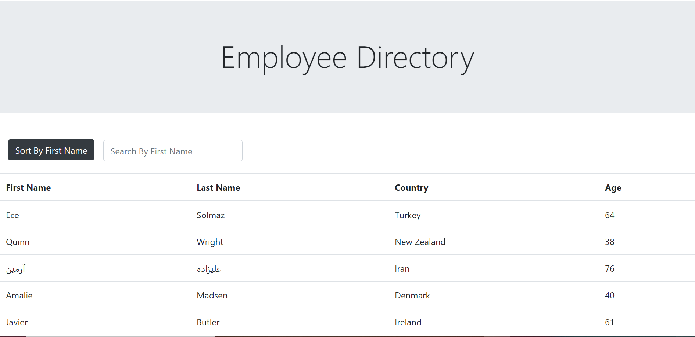
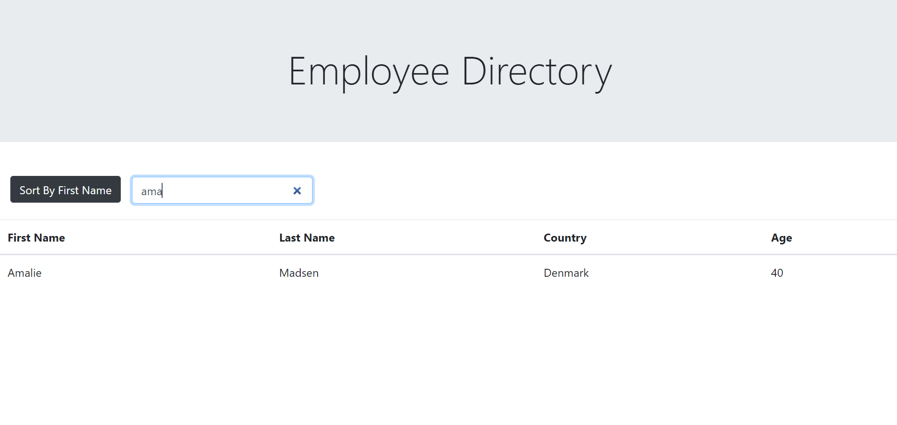

# employee-directory

## Description

Employee Directory is a front-end application built with React.js. The interface of the application is fairly simple. It has a Bootstrap Jumbatron at the top showing the name of the application. It also contains a Bootstrap table at the bottom of the page. And right in the middle it has a button to sort the data in the table by the first name and an input box to search the table by first name. The data in the table is pulled from the random user API. The first name, last name, country, and age are the four pieces of information extracted from each item in the array of objects. The API call requests ten random users with each call. Below is a picture of the landing page for the application.

Below is an image of the page after the data is sorted by first name.

And below is an image of the page after searching for a first name.

## Table of Contents

* [Installation](#installation)
* [Usage](#usage)
* [License](#license)
* [Contributing](#contributing)
* [Tests](#tests)
* [Questions](#questions)

## Installation

If you'd like to install the application to have the codebase, simply fork the repository to your own GitHub. Once you clone the repository to your computer, run npm install on your terminal to install all the dependencies. To bring up the application run npm start on you terminal. Alternatively, you can see the application in action by clicking the link below.

https://chavalk.github.io/employee-directory/

## Usage

The application's primary purpose is to give exposure to develop a front-end application from scratch using React.js.

## License

[MIT](https://choosealicense.com/licenses/mit/)

## Contributing

Contributions are currently not accepted for this application,

## Tests

There is no testing available within the application.

## Questions

My GitHub username is: chavalk

Link: https://github.com/chavalk

If you have additional questions, feel free to reach me at chavalk@hotmail.com.